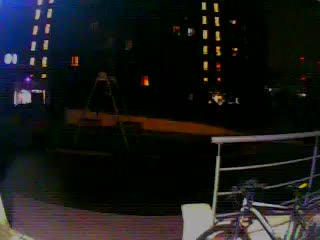

# Comelit entrance media — RUN5 evidence

Research evidence produced by the successful entrance-media RUN5 on
2026-09-10.

The repository is public. These files intentionally contain only selected
media evidence and derived codec diagnostics. Raw RTP, credentials, tokens,
SDP negotiation data, logs and protocol secrets are not included.

## Files

- `still.jpg` — decoded entrance-camera frame.
- `clip.mp4` — short decoded H.264 sample.
- `clip.ffprobe.txt` — container/video metadata.
- `still.ffprobe.txt` — JPEG metadata.
- `rtp-keyframe-report.txt` — derived positions/counts of SPS, PPS and IDR
  units in the original RUN5 RTP capture.

## Integrity

- clip.mp4 SHA256: `45e6c1439d7c038360e85576fe7df37ead79b110ed47ff183f9a85541415b6ea`
- still.jpg SHA256: `7bbeadae7ea4777d0b4d6485d453f42c982e5839f6b3c41155fcd323d3ac59e7`

## Preview

